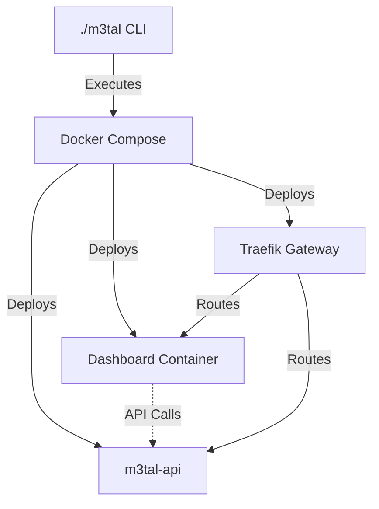

# 🚀 M3TAL Media Server (v1.7)

| [🚀 Overview](README.md) | [⚙️ Environment](docs/ENVIRONMENT_VARIABLES.md) | [🛠️ Build](docs/BUILD_CONFIGURATION.md) | [🌐 Networking](docs/NETWORKING.md) | [🤖 Architecture](docs/ARCHITECTURE_VISION.md) |
| :---: | :---: | :---: | :---: | :---: |

**DocSmith Status:** *Architecture Scan Complete. Schema Validated. System Optimized.*

M3TAL is a high-performance media server control plane engineered for lifecycle orchestration. Built with **Go 1.21+** (Core Orchestrator/API) and **Python 3.10** (Legacy Dashboard), it provides a unified interface for managing complex media service stacks with absolute path consistency.

---

## 🧠 Architecture: The M3TAL Ecosystem

The `m3tal` binary is the **sole orchestration entry point**. You interact only with this CLI tool; the Python dashboard runs **containerized** inside Docker, and the Go binary manages it automatically.

### System Components

* **Orchestrator (`./m3tal`)**: The Go-native binary acting as the primary control plane. It interfaces with the Docker socket to manage lifecycle, network configuration, and volume mapping.
* **Backend API (`./m3tal-api`)**: The Go-native service layer handling business logic and state management.
* **Infrastructure (`source/m3tal-stack/`)**: Standardized Docker Compose manifests. The `init` command generates these from templates in this directory.
* **Dashboard (`source/dashboard/`)**: Legacy Python/Flask web interface. Containerized via its own `Dockerfile`. 

### Relationship Mapping



> **Note on Go-Native Migration**: M3TAL is currently undergoing a structural evolution. While the `dashboard` remains Python-based for legacy compatibility, all orchestration, infrastructure management, and API-interfacing logic have been fully transitioned to Go-native modules to ensure memory safety and sub-millisecond execution.

---

## 🔗 Related Projects

* [m3tal-godash](https://github.com/jakej985-rgb/m3tal-godash): High-performance, Go-native dashboard rewrite.
* [m3tal-goback](https://github.com/jakej985-rgb/m3tal-goback): The evolving Go-native backend API implementation.

---

## 📄 Environment Configuration

All configuration lives in `.env`. See [Environment Variables](docs/ENVIRONMENT_VARIABLES.md) for full details.

| Variable | Required | Purpose |
| :--- | :--- | :--- |
| `BASE_STORAGE_PATH` | **YES** | Host path for media; mounted to `/mnt` inside containers. |
| `API_TOKEN` | **YES** | Auth token for Dashboard-to-API communication. |
| `DASHBOARD_SECRET` | **YES** | Session signing key. |

---

## 🛠️ Quick Start

```bash
# 1. Clone & Build
git clone https://github.com/jakej985-rgb/m3tal-core.git
cd m3tal-core
./build.sh  # Produces ./m3tal and ./m3tal-api

# 2. Initialize
./m3tal init

# 3. Launch
./m3tal up
```

### Path Consistency Rule
Every containerized service in the M3TAL stack uses a strict mapping where the host `BASE_STORAGE_PATH` is mounted to `/mnt` inside the container. **Do not modify these mount points** in the compose files, or the orchestration layer will lose visibility into your media data.

---

## 🛠️ CLI Command Reference

| Command | Description |
| :--- | :--- |
| `./m3tal init` | Initializes infrastructure and validates paths. |
| `./m3tal up` | Spins up the container stack via Go-orchestrated Compose. |
| `./m3tal doctor` | Validates host health, Docker socket, and port availability. |
| `./m3tal config` | Manages global `.env` settings. |

---

## 🧭 Troubleshooting

* **Orchestrator Desync**: Run `./m3tal init` to refresh Compose file templates.
* **Storage Path**: Ensure `BASE_STORAGE_PATH` is an absolute path. The containerized stack assumes `/mnt` is the root of your media drive.
* **Network**: If services are unreachable, verify Traefik is running and the `traefik_public` network is attached to the target containers.

*M3TAL Core — Precision Media Infrastructure.*