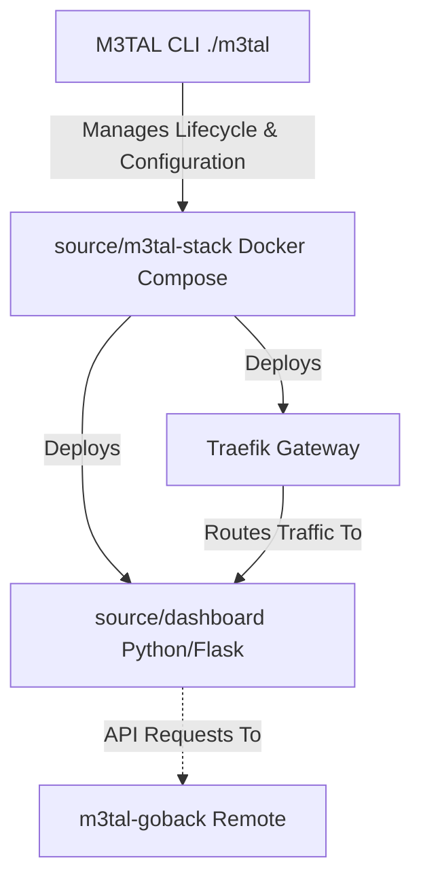

**DocSmith Status:** *Architectural Scan Complete. Repository README updated to reflect current Go-native state and module relationships.*

# 🚀 M3TAL Media Server (v1.7)

| [🚀 Overview](README.md) | [⚙️ Environment](docs/ENVIRONMENT_VARIABLES.md) | [🛠️ Build](docs/BUILD_CONFIGURATION.md) | [🌐 Networking](docs/NETWORKING.md) | [🤖 Architecture](docs/ARCHITECTURE_VISION.md) |
| :---: | :---: | :---: | :---: | :---: |

M3TAL is a high-performance media server control plane engineered for lifecycle orchestration. This repository serves as the **M3TAL Media Server**, the core Orchestrator for the integrated M3TAL ecosystem, leveraging **Go 1.21+** for robust, sub-millisecond control plane operations. It provides a unified interface for managing complex media service stacks with absolute path consistency.

---

## 🧠 Architecture: The M3TAL Ecosystem

The repository functions as the `M3TAL-Media-Server`, acting as the primary Orchestrator/Core. It manages the lifecycle and configuration of the infrastructure defined by the `m3tal-stack`, ensuring absolute control over deployed services.

### System Components

*   **Orchestrator (CLI)**: A Go-native binary compiled from the repository root. It serves as the primary control plane, interfacing directly with the Docker socket to orchestrate container lifecycles, network configurations, and volume mappings.
*   **Infrastructure (`source/m3tal-stack/`)**: Standardized Docker Compose manifests. These define the deployment of critical services, including the Traefik proxy and the dashboard container, managed by the CLI to ensure strict networking and storage compliance.
*   **Dashboard (`source/dashboard/`)**: The web-based management interface. Built as a Python/Flask application, it is containerized and deployed as a core service within the `m3tal-stack`.

### Relationship Mapping



**Operational Flow:**
The `M3TAL CLI` is the primary interface for system management. It interacts with `source/m3tal-stack` to deploy containers. The `Traefik Gateway` routes external traffic to the `dashboard`. The `dashboard` communicates exclusively via API with the `m3tal-goback` service—an external, dedicated M3TAL Backend API—to execute business logic.

> **Go-Native Migration Status**: The Orchestrator is fully Go-native, providing memory safety and peak performance for all control plane operations. While the `dashboard` remains Python-based for legacy compatibility, the ecosystem is actively migrating toward Go-native microservices.

---

## 🔗 Related Projects

This repository is a core component of the M3TAL ecosystem:

*   [m3tal-godash](https://github.com/jakej985-rgb/m3tal-godash): The next-generation, high-performance, Go-native dashboard replacement.
*   [m3tal-goback](https://github.com/jakej985-rgb/m3tal-goback): The evolving Go-native backend API implementation providing the core data/logic layer.

---

## 🛠️ Quick Start

```bash
# 1. Compile the M3TAL orchestrator
go build -o m3tal main.go 

# 2. Initialize infrastructure
./m3tal init

# 3. Launch stack
./m3tal up
```

### Path Consistency Rule
The M3TAL ecosystem mandates that the host `BASE_STORAGE_PATH` is always mounted to `/mnt` inside every container. **Do not modify these mount points**, as the orchestrator relies on this structure for deterministic lifecycle management and volume integrity.

---

## 🛠️ CLI Command Reference

| Command               | Description                                                  |
| :-------------------- | :----------------------------------------------------------- |
| `./m3tal init`        | Syncs configuration and validates host path requirements.    |
| `./m3tal up`          | Deploys the containerized stack via Docker Compose.          |
| `./m3tal doctor`      | Diagnostic scan (Docker, ports, and path health).            |
| `./m3tal config`      | Interface for updating global `.env` parameters.             |
| `./m3tal down`        | Stops and purges the M3TAL stack.                            |

---

## 🧭 Troubleshooting

*   **Desynchronization**: If infrastructure states drift, run `./m3tal init` to refresh Compose templates.
*   **Storage Path Issues**: Ensure `BASE_STORAGE_PATH` is an absolute path. The stack assumes `/mnt` is the internal media root.
*   **Dashboard API Errors**: Ensure the external `m3tal-goback` is reachable and the `API_TOKEN` matches the environment settings.

*M3TAL Core — Precision Media Infrastructure.*