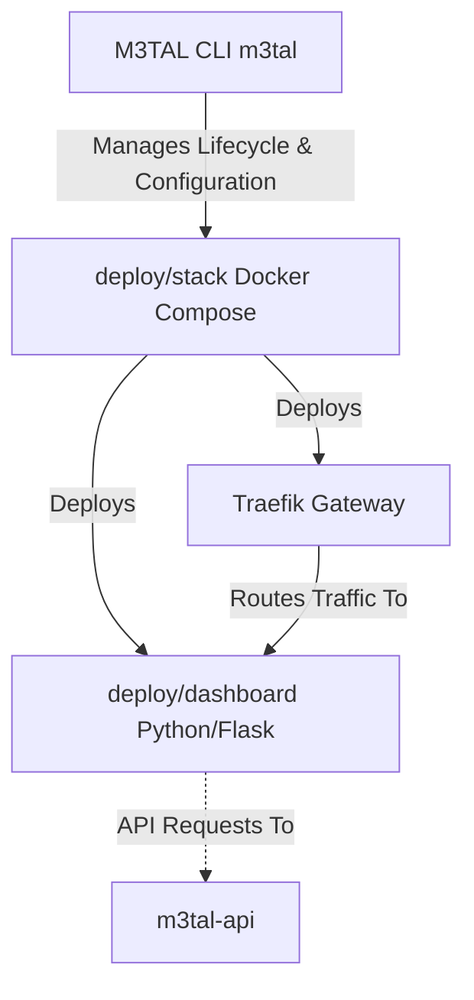

**DocSmith Status:** *Architectural Scan Complete. Repository README updated to reflect current Go-native state and module relationships.*

# 🚀 M3TAL Media Server (v1.7)

| [🚀 Overview](README.md) | [⚙️ Environment](docs/ENVIRONMENT_VARIABLES.md) | [🛠️ Build](docs/BUILD_CONFIGURATION.md) | [🌐 Networking](docs/NETWORKING.md) | [🤖 Architecture](docs/ARCHITECTURE_VISION.md) |
| :---: | :---: | :---: | :---: | :---: |

M3TAL is a high-performance media server control plane engineered for lifecycle orchestration. This repository serves as the **M3TAL Media Server**, the core Orchestrator for the integrated M3TAL ecosystem, leveraging **Go 1.21+** for robust, sub-millisecond control plane operations. It provides a unified interface for managing complex media service stacks with absolute path consistency.

---

## 🧠 Architecture: The M3TAL Ecosystem

The repository functions as the `M3TAL-Media-Server`, acting as the primary Orchestrator/Core. It manages the lifecycle and configuration of the infrastructure defined by the `m3tal-stack`, ensuring absolute control over deployed services.

### System Components

*   **Orchestrator (`m3tal` CLI)**: The Go-native binary compiled from the repository root. It serves as the control plane, interfacing directly with the Docker socket to manage container lifecycles, network configurations, and volume mappings for the `m3tal-stack`.
*   **Infrastructure (`deploy/stack/`)**: Standardized Docker Compose manifests. These define the deployment of critical services, including the Traefik proxy and the `dashboard` container, all managed by the `m3tal` orchestrator to ensure strict networking and storage compliance.
*   **Dashboard (`deploy/dashboard/`)**: The web interface for the M3TAL system. Built as a Python/Flask application, it is containerized and deployed as a core component of the `m3tal-stack`.

### Relationship Mapping



**Operational Flow:**
The `M3TAL CLI` is the primary interface for system management. It interacts with `deploy/stack` to deploy containers. The `Traefik Gateway` routes external traffic to the `dashboard`. The `dashboard` communicates exclusively via API with the `m3tal-api` service to execute business logic.

> **Go-Native Migration Status**: The Orchestrator is fully Go-native, providing memory safety and peak performance for all control plane operations. While the `dashboard` remains Python-based for legacy compatibility, the ecosystem is actively migrating toward Go-native microservices.

---

## 🔗 Related Projects

This repository is a core component of the M3TAL ecosystem:

*   [m3tal-godash](https://github.com/jakej985-rgb/m3tal-godash): The next-generation, high-performance, Go-native dashboard replacement.
*   [m3tal-goback](https://github.com/jakej985-rgb/m3tal-goback): The evolving Go-native backend API implementation providing the core data/logic layer.

---

## 📋 Requirements

Before installing M3TAL Core, ensure the following are installed on your host system:
- **Docker Engine**: [Install Guide](https://docs.docker.com/engine/install/)
- **Docker Compose V2**: Standard with modern Docker Desktop/Engine.

---

## 🛠️ Quick Start (Recommended)

M3TAL is now distributed as a native Debian package. This is the recommended way to install it on Linux.

```bash
# 1. Add the M3TAL repository
curl -sL https://jakej985-rgb.github.io/m3tal-core/public.key | sudo apt-key add -
echo 'deb [arch=amd64] https://jakej985-rgb.github.io/m3tal-core stable main' | sudo tee /etc/apt/sources.list.d/m3tal.list

# 2. Install M3TAL Core
sudo apt-get update && sudo apt-get install -y m3tal-core

# 3. Configure and Initialize
sudo m3tal config set path /path/to/your/media
sudo m3tal init

# 4. Verify and Start
m3tal doctor
m3tal up
```

### ⚙️ Initial Configuration
The platform looks for its configuration at `/etc/m3tal/config.yaml`. You can manually create/edit this file or use the `m3tal config` command.
```bash
# Example manual setup:
BASE_STORAGE_PATH=/home/user/media
API_TOKEN=generate_a_secure_random_string
```

### 🌐 Networking & Access
By default, M3TAL exposes the Dashboard on port `80` (HTTP) and `443` (HTTPS). Ensure these ports are open on your host firewall.

### Development / Local Build
If you prefer to build from source:
```bash
go build -o m3tal ./cmd/m3tal
./m3tal init
./m3tal up
```

### 📁 Path Consistency Rule
The orchestrator mandates that your `BASE_STORAGE_PATH` is mapped to `/mnt` inside every container. If your media is stored at `/data`, the orchestrator will automatically bind `/data` to `/mnt` within the container context. **Do not modify these internal mount points** to ensure volume integrity.

---

## 🛠️ CLI Command Reference

| Command           | Description                                                  |
| :---------------- | :----------------------------------------------------------- |
| `m3tal init`      | Syncs configuration and validates host path requirements.    |
| `m3tal up`        | Deploys the containerized stack via Docker Compose.          |
| `m3tal doctor`    | Diagnostic scan (Docker, ports, and path health).            |
| `m3tal config`    | Interface for updating global configuration parameters.      |
| `m3tal down`      | Stops and purges the M3TAL stack.                            |

---

## 🧭 Troubleshooting

*   **Desynchronization**: If infrastructure states drift, run `m3tal init` to refresh templates.
*   **Storage Path Issues**: Ensure `BASE_STORAGE_PATH` is an absolute path. The stack assumes `/mnt` is the internal media root.
*   **Dashboard API Errors**: Ensure the `m3tal-api` is reachable and the `API_TOKEN` matches.

*M3TAL Core — Precision Media Infrastructure.*